# GRUForecast - Model Architecture & Documentation

A complete guide to understanding how the stock price prediction model works.

---

## Table of Contents

1. [Overview](#overview)
2. [Model Architecture](#model-architecture)
3. [Data Pipeline](#data-pipeline)
4. [Training Process](#training-process)
5. [Inference Process](#inference-process)
6. [Worked Example](#worked-example)
7. [Quantile Predictions](#quantile-predictions)

---

## Overview

GRUForecast is a deep learning model that predicts stock prices up to 30 days ahead. It uses:

- **GRU (Gated Recurrent Unit)** layers to learn temporal patterns
- **Multi-Head Attention** to focus on important time steps
- **Quantile Regression** to provide uncertainty estimates

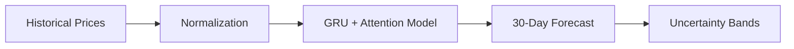

### Key Features

| Feature | Description |
|---------|-------------|
| Input | 100 days of closing prices |
| Output | 30-day forecast with confidence bands |
| Architecture | GRU + Multi-Head Attention |
| Loss Function | Quantile Loss (Pinball) |
| Outputs | 3 quantiles: 10%, 50%, 90% |

---

## Model Architecture

### High-Level Architecture

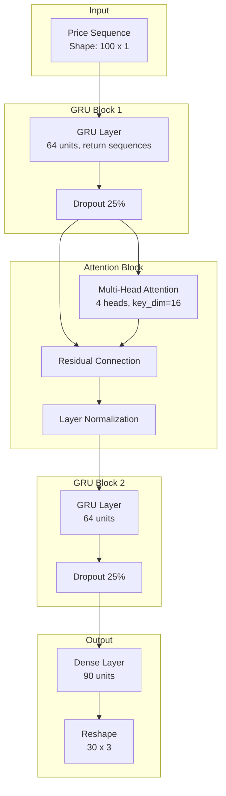

### Layer-by-Layer Breakdown

#### 1. Input Layer
```
Shape: (batch_size, 100, 1)
```
- Takes 100 days of normalized closing prices
- Each price is a single feature (univariate time series)

#### 2. First GRU Layer
```
GRU(64, return_sequences=True)
```
- 64 hidden units
- Returns output for each time step (100 outputs)
- Learns short-term and medium-term patterns

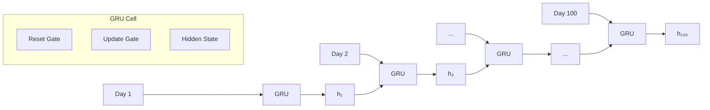

#### 3. Dropout Layer
```
Dropout(0.25)
```
- Randomly drops 25% of connections during training
- Prevents overfitting

#### 4. Multi-Head Self-Attention
```
MultiHeadAttention(num_heads=4, key_dim=16)
```
- 4 parallel attention heads
- Each head learns different relationships
- Allows model to focus on relevant past days

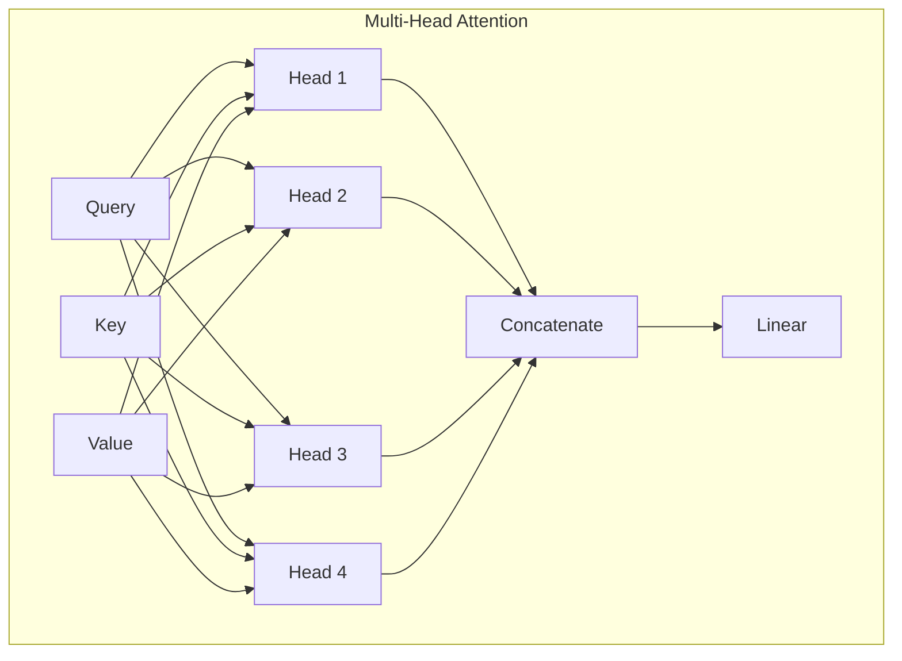

**Why Attention?**
- Can identify which past days are most relevant for prediction
- Example: A price spike 30 days ago might be more relevant than yesterday's small movement

#### 5. Residual Connection + Layer Normalization
```python
x = Add()([x, attention_output])  # Residual
x = LayerNormalization()(x)
```
- Residual connection helps gradients flow during training
- Layer normalization stabilizes training

#### 6. Second GRU Layer
```
GRU(64)
```
- Compresses the sequence into a single vector
- Output shape: (batch_size, 64)

#### 7. Output Layers
```python
Dense(90)           # 30 days × 3 quantiles = 90
Reshape((30, 3))    # Reshape to (30, 3)
```
- Produces 30 predictions, each with 3 quantile values

---

## Data Pipeline

### Training Data Flow

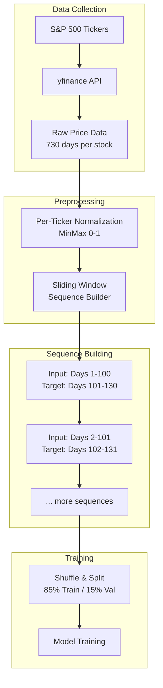

### Normalization

Each stock is normalized independently using MinMax scaling:

```
normalized_price = (price - min_price) / (max_price - min_price)
```

**Example:**
```
AAPL prices: [150, 155, 160, 145, 170]
Min: 145, Max: 170

Normalized: [0.20, 0.40, 0.60, 0.00, 1.00]
```

### Sequence Building

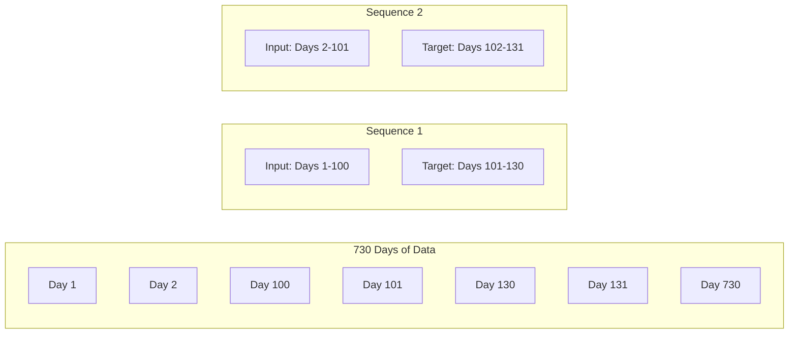

From 730 days, we generate approximately **600 sequences** per stock.

---

## Training Process

### Loss Function: Quantile Loss

The model uses **Pinball Loss** (Quantile Loss) to learn different percentiles:

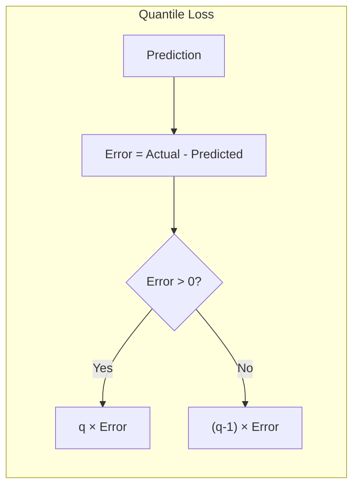

**Formula:**
```
L(y, ŷ, q) = max(q × (y - ŷ), (q - 1) × (y - ŷ))
```

For q = 0.5 (median):
- Penalizes over-predictions and under-predictions equally

For q = 0.9 (upper bound):
- Penalizes under-predictions more heavily
- Model learns to predict higher values

For q = 0.1 (lower bound):
- Penalizes over-predictions more heavily
- Model learns to predict lower values

### Training Loop

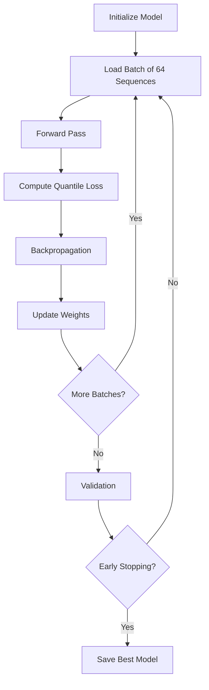

### Callbacks

1. **ReduceLROnPlateau**: Reduces learning rate when validation loss plateaus
2. **EarlyStopping**: Stops training if no improvement for 5 epochs

---

## Inference Process

### Prediction Flow

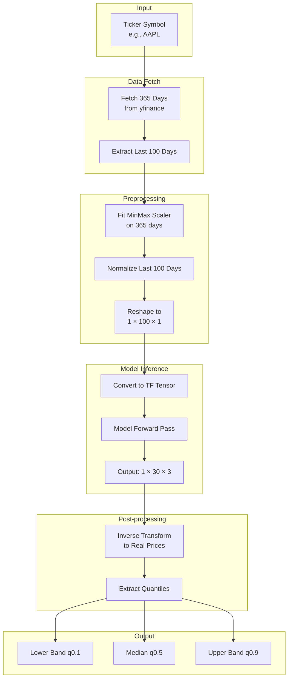

### Why Per-Ticker Scaling at Inference?

- Different stocks have vastly different price ranges (AAPL ~$150 vs BRK-A ~$600,000)
- Training used per-ticker scaling, so inference must match
- Scaler is fitted on recent 365 days to capture current price range

---

## Worked Example

Let's walk through a complete prediction for **AAPL**.

### Step 1: Fetch Data

```
Fetched 365 days of AAPL closing prices
Latest prices: [..., 245.12, 246.50, 247.53]
Current price: $247.53
```

### Step 2: Normalize

```
Min price (365 days): $165.00
Max price (365 days): $260.00
Range: $95.00

Normalized current price: (247.53 - 165) / 95 = 0.869
```

### Step 3: Create Input Sequence

```
Last 100 normalized prices → Shape: (1, 100, 1)
[0.521, 0.534, 0.548, ..., 0.856, 0.869]
```

### Step 4: Model Prediction

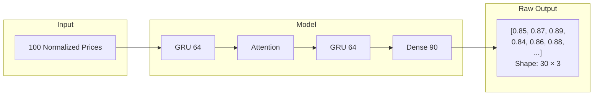

### Step 5: Inverse Transform

```
Raw prediction (Day 1): [0.82, 0.87, 0.92]

Inverse transform:
- Lower (q0.1): 0.82 × 95 + 165 = $242.90
- Median (q0.5): 0.87 × 95 + 165 = $247.65
- Upper (q0.9): 0.92 × 95 + 165 = $252.40
```

### Step 6: Final Output

```
{
  "ticker": "AAPL",
  "current_price": 247.53,
  "predicted_price": 247.65,      # Day 1 median
  "price_change": +0.12,
  "price_change_percent": +0.05%,
  "predictions": {
    "lower":  [242.90, 241.50, ...],  # 30 values
    "median": [247.65, 248.20, ...],  # 30 values
    "upper":  [252.40, 254.90, ...]   # 30 values
  }
}
```

---

## Quantile Predictions

### What Are Quantiles?

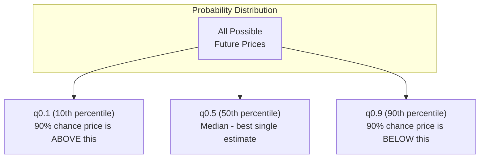

### Interpretation

| Quantile | Meaning | Use Case |
|----------|---------|----------|
| q0.1 | Lower bound | Worst-case scenario |
| q0.5 | Median | Best point estimate |
| q0.9 | Upper bound | Best-case scenario |

### Visual Representation

```
Price ($)
   |
260|                    ╱───── Upper (q0.9)
   |                 ╱─╱
250|              ╱─╱    ───── Median (q0.5)
   |           ╱─╱
240|        ╱─╱──────────────── Lower (q0.1)
   |     ╱─╱
230|  ╱─╱
   |─╱
   └──────────────────────────────
   Today    Day 10    Day 20    Day 30
```

The shaded area between q0.1 and q0.9 represents the **80% confidence interval**.

---

## Model Limitations

1. **Only uses closing prices** - No volume, fundamentals, or news
2. **Assumes patterns repeat** - May fail during unprecedented events
3. **Global model** - Same model for all stocks; may underperform on unusual stocks
4. **30-day horizon** - Accuracy decreases for longer forecasts

---

## Summary

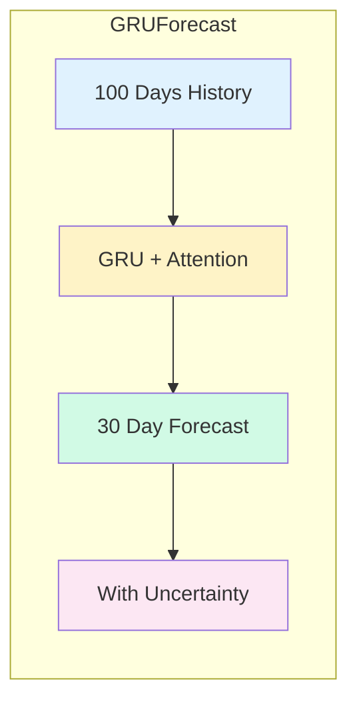

**Key Takeaways:**

1. GRU learns sequential patterns in price movements
2. Attention helps focus on relevant past events
3. Quantile loss provides uncertainty estimates
4. Per-ticker normalization handles different price scales
5. 80% confidence bands give a range of likely outcomes

---

*For implementation details, see the [Colab Notebook](Stock_Predictor_Colab.ipynb).*
