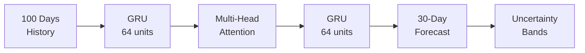

# GRUForecast

[](https://colab.research.google.com/github/fyzanshaik/GRUForecast/blob/main/Stock_Predictor_Colab.ipynb)

A full-stack web application for predicting stock prices using **GRU + Multi-Head Attention** neural networks with quantile regression for uncertainty estimation.

## Model Architecture



**Key Features:**
- **GRU + Attention**: Captures temporal patterns and focuses on relevant time steps
- **Quantile Outputs**: Predicts 10th, 50th, and 90th percentiles for uncertainty estimation
- **Per-Ticker Normalization**: Handles stocks with vastly different price ranges
- **30-Day Horizon**: Forecasts up to 30 days ahead with confidence bands

> See [ARCHITECTURE.md](ARCHITECTURE.md) for detailed model documentation with diagrams and examples.

## Try it Now

Run the complete training and prediction pipeline in Google Colab (no setup required):

[](https://colab.research.google.com/github/fyzanshaik/GRUForecast/blob/main/Stock_Predictor_Colab.ipynb)

The notebook includes:
- Data collection from 50 S&P 500 stocks
- Interactive visualizations
- Model training with GPU acceleration
- Multi-stock predictions with confidence bands

## Features

- Real-time stock price predictions with uncertainty bands
- Support for multiple stock exchanges (NYSE, NASDAQ, NSE)
- Interactive charts and visualizations
- Forecast up to 30 days ahead
- Beautiful, modern UI with Tailwind CSS

## Tech Stack

### Frontend
- React 18
- Recharts for data visualization
- Tailwind CSS for styling
- Axios for API calls

### Backend
- FastAPI
- TensorFlow/Keras for the GRU model
- Twelve Data API for stock data
- NumPy, Pandas for data processing

### Model
- GRU (Gated Recurrent Unit) layers
- Multi-Head Self-Attention
- Quantile Loss (Pinball Loss)
- Per-ticker MinMax normalization

## Setup Instructions

### Prerequisites
- Python 3.12+
- Node.js 14+
- npm or yarn

### Backend Setup

1. Navigate to backend directory:
```bash
cd backend
```

2. Create virtual environment:
```bash
python -m venv venv
source venv/bin/activate  # On Windows: venv\Scripts\activate
```

3. Install dependencies:
```bash
pip install -r requirements.txt
```

4. Add Twelve Data API key:
   - Create `backend/.env` and set `TWELVE_API_SECRET_KEY`

5. Ensure model file exists:
   - Place your trained `lstm_model.keras` file in `backend/models/` directory
   - Or train a new model using the Colab notebook

6. Run the server:
```bash
python main.py
```

Backend runs on: http://localhost:8000

### Frontend Setup

1. Navigate to frontend directory:
```bash
cd frontend
```

2. Install dependencies:
```bash
npm install
```

3. Start development server:
```bash
npm start
```

Frontend runs on: http://localhost:3000

## API Endpoints

### POST `/api/predict`
Predict stock price for a given ticker.

**Request:**
```json
{
  "ticker": "AAPL",
  "days_ahead": 5
}
```

**Response:**
```json
{
  "ticker": "AAPL",
  "current_price": 247.65,
  "predicted_price": 257.22,
  "predictions": [257.22, 255.76, ...],
  "days_ahead": 5,
  "recent_prices": [...],
  "price_change": 9.57,
  "price_change_percent": 3.86,
  "timestamp": "2024-01-22T10:30:00"
}
```

### GET `/api/model-info`
Get model architecture and details.

### GET `/health`
Health check endpoint.

## Project Structure

```
GRUForecast/
├── backend/
│   ├── main.py                    # FastAPI application
│   ├── train_model.py             # Training script
│   ├── models/
│   │   ├── lstm_model.keras       # Trained model
│   │   ├── lstm_predictor.py      # Prediction logic
│   │   └── training_metrics.json  # Training results
│   ├── data_providers/
│   │   ├── twelvedata.py          # Twelve Data API client
│   │   └── ticker_universe.py     # S&P 500 tickers
│   ├── data_cache/                # Cached stock data
│   ├── routes/
│   │   ├── prediction.py          # Prediction endpoints
│   │   └── model_info.py          # Model info endpoints
│   └── requirements.txt
├── frontend/
│   ├── src/
│   │   ├── App.tsx                # Main React component
│   │   └── components/            # UI components
│   └── package.json
├── Stock_Predictor_Colab.ipynb    # Google Colab notebook
├── ARCHITECTURE.md                # Model documentation
└── README.md
```

## Model Performance

| Metric | Value |
|--------|-------|
| Validation MAE (USD) | ~$7.91 |
| Validation MAPE | ~4.57% |
| Validation SMAPE | ~4.53% |
| Training Samples | 15,000+ |

## Usage

1. Start both backend and frontend servers
2. Open http://localhost:3000 in your browser
3. Enter a stock ticker symbol (e.g., AAPL, MSFT, TCS.NS)
4. Select the number of days to forecast (1-30)
5. Click "Forecast" to get predictions with confidence bands

## Supported Stock Exchanges

- US Stocks: AAPL, GOOGL, MSFT, TSLA, etc.
- Indian Stocks: TCS.NS, RELIANCE.NS, INFY.NS, etc.
- Cryptocurrencies: BTC-USD, ETH-USD

## Documentation

- [ARCHITECTURE.md](ARCHITECTURE.md) - Detailed model architecture with diagrams
- [backend/ML_MODEL.md](backend/ML_MODEL.md) - Training pipeline documentation

## Notes

- Predictions are for **educational purposes only**
- Model accuracy depends on training data and market conditions
- **Not financial advice**
- Uncertainty bands represent 80% confidence interval

## License

MIT

## Contributing

Contributions are welcome! Please feel free to submit a Pull Request.
