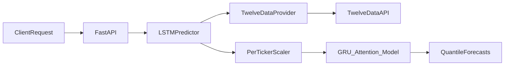
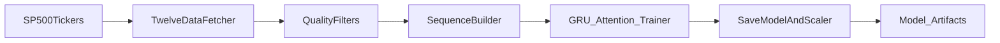

## ML Model Documentation

This document explains the current training and inference pipeline, model architecture, and data flow for the stock predictor.

### Overview

The model is a global sequence model trained on S&P 500 daily close prices (2 years by default) using Twelve Data. It predicts a 30‑day horizon by outputting quantiles (0.1, 0.5, 0.9). The median (0.5) is used as the primary forecast and the other quantiles can be used for uncertainty bands.

### Data Flow

### Training Pipeline

Training is done by `backend/train_model.py`. For each ticker:
- Fetch daily close prices for `TRAIN_DAYS`.
- Skip low‑price series (`TRAIN_MIN_PRICE`) or insufficient history (`TRAIN_MIN_HISTORY`).
- Fit a per‑ticker MinMax scaler and build sequences of length `SEQUENCE_LENGTH`.
- Train a single global model with quantile loss.

### Architecture (2026)

The model is a GRU + attention stack with dropout and a quantile head.

```mermaid
flowchart LR
    Input[Sequence_Lx1] --> GRU1[GRU_64_ReturnSeq]
    GRU1 --> Drop1[Dropout_0.25]
    Drop1 --> Attn[MultiHeadAttention_4x16]
    Attn --> Add[ResidualAdd]
    Add --> Norm[LayerNorm]
    Norm --> GRU2[GRU_64]
    GRU2 --> Drop2[Dropout_0.25]
    Drop2 --> Dense[Dense_Horizonx3]
    Dense --> Reshape[Reshape_Horizon_By_Quantile]
```

### Quantile Outputs

The final layer predicts:
- q0.1 (lower band)
- q0.5 (median)
- q0.9 (upper band)

The predictor uses q0.5 for the main output. The q0.1/q0.9 bands can be added to API/UI if desired.

### Loss and Metrics

Loss:
- Quantile loss (pinball loss) for q0.1, q0.5, q0.9

Metrics:
- Median MAE (normalized)
- Median MAPE (normalized)
- Validation MAE/MAPE/SMAPE in USD scale (computed after inverse scaling)

### Inference Behavior

At inference time:
- Fetch recent closes for the ticker.
- Fit a per‑ticker MinMax scaler in memory (cached by ticker).
- Scale input, run model, inverse scale output.
- Reject invalid or extreme outputs (>200% change).

This avoids global scaling issues and reduces extreme predictions.

### Artifacts

Generated by training:
- `backend/models/lstm_model.keras` (model weights + architecture)
- `backend/models/scaler.pkl` (global scaler snapshot; optional)
- `backend/models/training_metrics.json` (training summary)

### Key Environment Variables

Training:
- `TRAIN_DAYS=730`
- `TRAIN_HORIZON=30`
- `TRAIN_EPOCHS=20`
- `TRAIN_BATCH_SIZE=64`
- `TRAIN_MAX_TICKERS=200`
- `TRAIN_MIN_PRICE=5`
- `TRAIN_MIN_HISTORY=140`
- `TRAIN_REQUEST_DELAY=0.2`
- `TRAIN_SEED=42`
- `TRAIN_USE_CACHE=false`
- `TRAIN_CACHE_TTL_DAYS=7`

Inference:
- `SEQUENCE_LENGTH=100`
- `DATA_DAYS=365`
- `DATA_INTERVAL=1day`

### Caching

If `TRAIN_USE_CACHE=true`, raw time series are cached in:
- `backend/data_cache/{TICKER}.csv`

This reduces Twelve Data credits usage on re‑runs.

### Known Limitations

- The model is trained on daily closes only; it does not use volume or fundamentals.
- Global model may underperform on very low‑liquidity tickers.
- Quantile bands are probabilistic and not calibrated to a strict confidence level.

### Next Improvements (Optional)

- Add volume and technical indicators to feature set.
- Add a calibration layer for quantile bands.
- Track per‑ticker validation metrics for data quality filtering.
